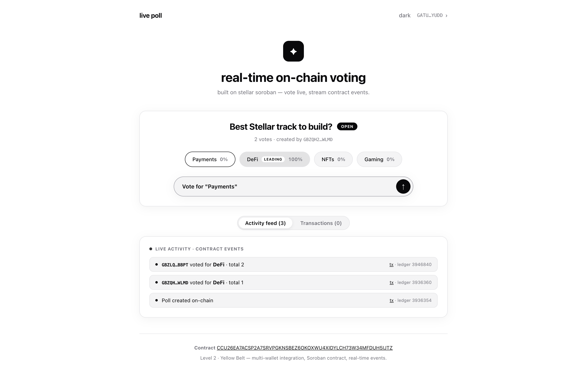
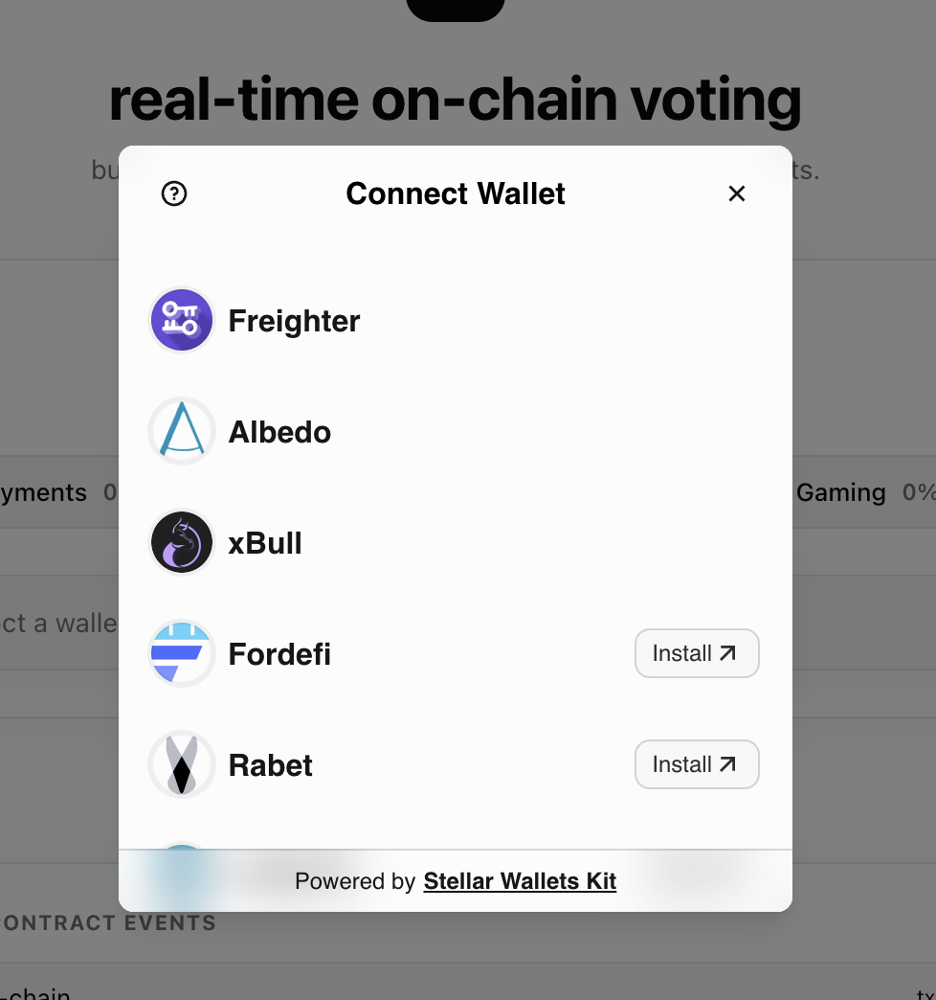

# Live Poll — Stellar Yellow Belt (Level 2)

A **real-time on-chain poll** built on Stellar (Soroban). Multi-wallet support,
a deployed testnet contract, live contract-event streaming, and full
transaction status tracking.

---

## ✨ What it does

- **Multi-wallet integration** via [StellarWalletsKit v2](https://stellarwalletskit.dev) —
  Freighter, Albedo, xBull, Rabet, Lobstr, Hana, Hot Wallet, OneKey, Klever, Bitget and more,
  all through one API + one auth modal.
- **Deployed Soroban contract** on testnet (`live-poll`) — one question, up to 10
  options, one vote per wallet, admin can close.
- **Real-time event handling** — the frontend streams `created`, `vote_cast` and
  `closed` contract events via `getEvents` and syncs the poll state live.
- **Transaction status tracking** — every write goes through
  `pending → success / failed` with a link to Stellar Expert.

---

## 🖼 Wallet options

Multi-wallet selection via [StellarWalletsKit v2](https://stellarwalletskit.dev) —
the `Connect wallet` button opens an auth modal listing every supported wallet
(an install label is shown for ones not present), and the header shows
availability chips for them.

---

## 🔗 Deployed on testnet

| Item | Value |
| --- | --- |
| **Contract** | `CCU26EA7ACSP2A7SRVPGKNSBEZ6OKOXWU4XIDYLCH73W34MFDUH5IJTZ` |
| Contract explorer | https://stellar.expert/explorer/testnet/contract/CCU26EA7ACSP2A7SRVPGKNSBEZ6OKOXWU4XIDYLCH73W34MFDUH5IJTZ |
| Poll admin | `GBZQH26BVZ3T7AFAPULBNFUSB6A2O2X6IBQ4AGOZHMYUSJSSRPJAWLMD` |
| Network | Test SDF Network ; September 2015 (testnet) |
| RPC | `https://soroban-testnet.stellar.org` |

### Verifiable transaction hashes

| Action | Transaction hash |
| --- | --- |
| Contract deploy | `96bf843af442d2e1e332cb2db64a719b629393201311a37cbb97b966eab4c7c9` |
| `initialize` (poll created) | `e24477bbc3148265dd4acc59e80d880eaf76d6984384bba7ca39115ce59d3377` |
| `vote` (from CLI) | `048e8e6cbd102e275280708e27822656e952e354991f919d6871313f3580ed48` |
| `vote` (from the app via Freighter) | `37a59ed9e017c1216400f8d6a3b7aeba98ae38a720bee76236b7c38d5e7d6ba6` |

Each hash is viewable at `https://stellar.expert/explorer/testnet/tx/<hash>`.
New votes from the app also appear in the status panel with an explorer link.

---

## 🛠 Setup & project structure

See [SETUP.md](SETUP.md) for the full project structure, prerequisites, and how
to run the frontend or build/redeploy the contract locally.

---

## 🔗 Links

- Live demo: https://steller-yellow-belt-omega.vercel.app/
- Stellar Expert: https://stellar.expert/explorer/testnet
